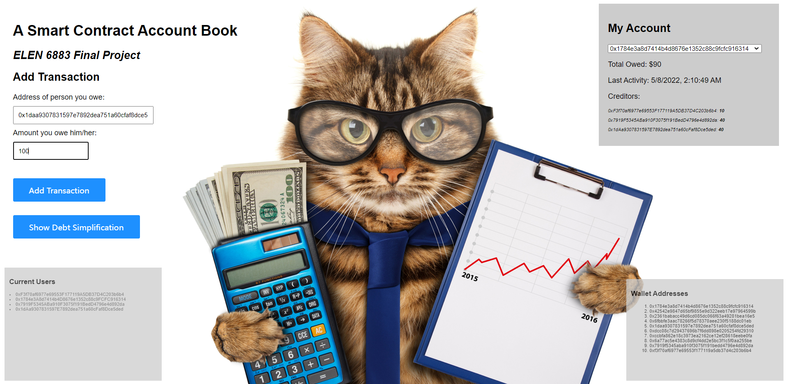

# Smart-Contract-Account-Book

## Project Overview

Combining the basic concept of smart contract and Ethereum introduced on lecture four and five, we are going to build a decentralized application (DAPP) called Smart Contract Account Book for our project. The basic functions of our DAPP are one-to-one accounting, billing displaying and the transaction simplification, which can directly display the amount of money of one user owing to other users, and moreover provide a simplified approach for all the users to pay their debts in minimum number of transaction. This project is not only a practice of smart contract coding but also a practical application called Splitwise implemented on Ethereum based on decentralized concept.

## DAPP Function:

### One-to-one Accounting

This basic one-to-one accounting enables users to clearly record the debt amount to every other user, which the information is stored as a dictionary in the smart contract.

### Billing Display

We store the billing information after every transaction, record the units of the object user owing to other users. The billing information can be shown on the top-right corner of the UI interaction interface of the lists of users and the units that the object user owing to.

### Debt Simplification

The purpose of this function is to find a simplest strategy for every users to pay their debts in minimum number of transaction. Behind this function, we implemented the Maximum-Flow algorithm of Graph Theory on smart contract solidity coding, where the main idea is to iterate the pair of maximum creditor and debtor as the source and sink of graph, compute the maximum cash flow between them and replace the residual graph as the new graph.

## Run the Code

1. Compile smart contract: Add `mycontract.sol` to Remix - Ethereum IDE and compile.
2. Set up Ganache: Run `ganache-cli` in local terminal.
3. Deploy contract: At DEPLOY & RUN TRANSACTIONS interface, select Web3 Provider as environment and deploy the smart contract. Then copy the contract address/hash and change the `contractAddress` in script.js.
4. Interact with UI: Open `index.html` in any browser. Enjoy using our splitwise DAPP!

## Demo Display:

Please feel free to check our demo at https://youtu.be/az5OQGlYjJU

